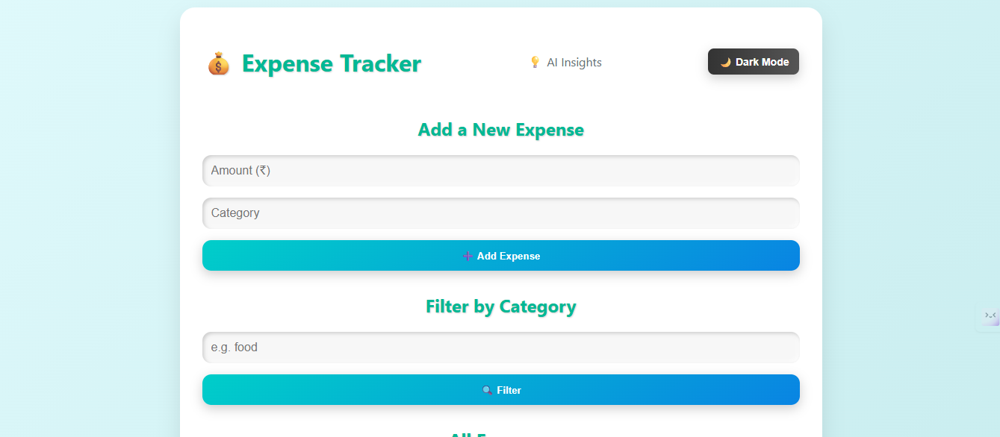
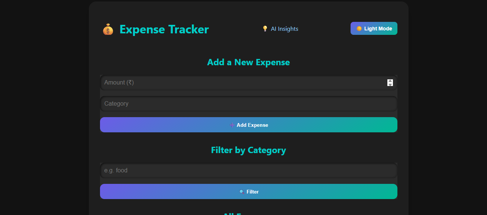

💰 AI-Powered Expense Tracker

> A sleek, 3D-styled web app to track your expenses and get smart AI-powered spending insights — built with Flask + OpenAI 💡✨


---

🚀 Features

✅ Add, view & filter expenses by category  
🌗 Dark mode toggle (☀️ / 🌙)  
🧠 Smart spending insights using OpenAI GPT  
🎨 Beautiful 3D-like UI with animated transitions  
📊 Total expense summary  
🔍 Category filter  

---

🖼️ Screenshots

| Light Mode 💡 | Dark Mode 🌙 |
|--------------|-------------|
|  |  |


---

🧠 AI Insights Preview


> The app uses GPT to analyze your spending and generate fun, helpful insights!

---

🛠️ Tech Stack

- 💻 Python (Flask)
- 🎨 HTML + CSS (custom 3D design)
- 🌐 OpenAI API
- 📦 Git + GitHub

---

🧪 Setup Instructions

1. 🔽 Clone this repo:

```bash
git clone https://github.com/yourusername/expense-tracker-web.git
cd expense-tracker-web
````

2. 🧪 Create virtual environment:

```bash
python -m venv venv
venv\Scripts\activate     # On Windows
```

3. 📦 Install dependencies:

```bash
pip install -r requirements.txt
```

4. 🔑 Set up your OpenAI API key:

```bash
set OPENAI_API_KEY=your_api_key_here
```

5. ▶️ Run the app:

```bash
python app.py
```

Visit: [http://localhost:5000](http://localhost:5000)

---

🧠 Powered by

* [OpenAI GPT](https://platform.openai.com/)
* [Flask](https://flask.palletsprojects.com/)
* \[Your creativity 💡]

---

📃 License

This project is licensed under the MIT License.

---

🧑‍💻 Author

Built with ❤️ by [Tejas Indrale](https://github.com/Tejas-Indrale)

---

⭐️ Star this repo if it helped you!
